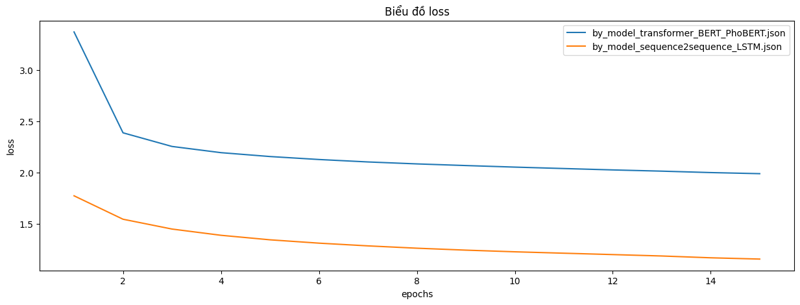
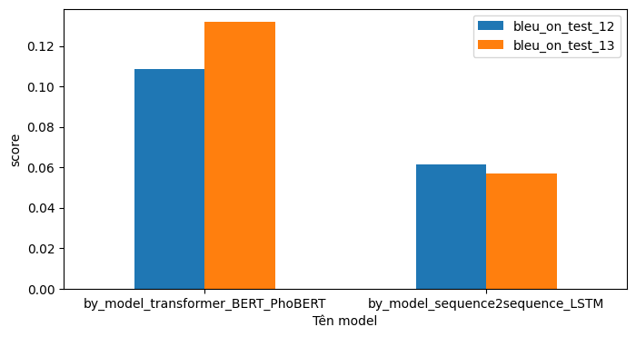
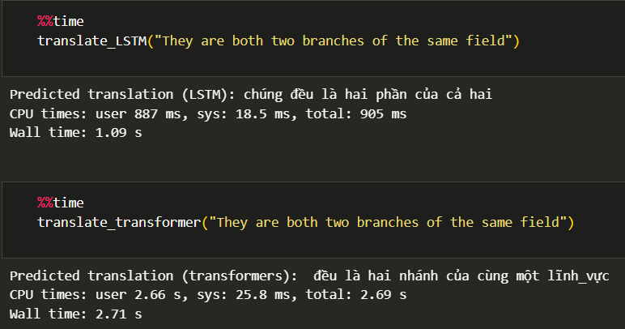

# Machine-Translation

## Dataset
Đồ án tiến hành được thực nghiệm trên bộ dữ liệu [IWSLT'15 English-Vietnamese data [Small]](https://nlp.stanford.edu/projects/nmt/) từ Stanford NLP Group. 
Bộ dữ liệu gồm:
-	Các cặp câu huấn luyện được lưu trữ trong ‘train.en’ (tiếng Anh) và ‘train.vi’ (tiếng Việt), bao gồm 133K câu trong mỗi file. 
-	Bộ kiểm tra được lấy từ ‘tst2012.en’ và ‘tst2012.vi’ (1,5K cặp), ‘tst2013.en’ và ‘tst2013.vi’ (1,2K cặp).
## Code
Trong phần này, mình sử dụng các kiến trúc mô hình khác nhau cho bài toán Machine-Translation:  
- LSTM
- Transformer
## Link pre-trained
https://drive.google.com/drive/folders/1SrrA67H8Ff8ePPtj4lUloIpNx_mSulwO?usp=sharing
## Evaluation
- Biểu đồ Loss

- Bảng đánh giá theo thời gian train và test

- Bảng đánh giá theo blue_score

- Demo

